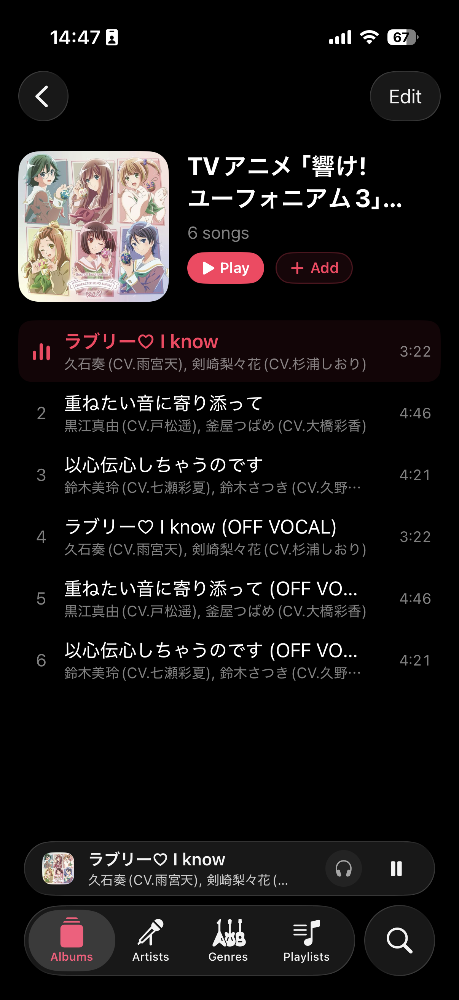

#  KanadeApp

Native iOS & macOS client for [kanade](https://github.com/petitstrawberry/kanade) — a self-hosted, multi-room music system.

Any device on your network can act as an output node. Play music in the living room from your iPhone, hand off to the study's speaker from your Mac, or stream directly to your headphones — all from the same app, against the same server.

## Screenshots

| iPhone                                                 | iPhone (Dark)                          | Mac |
| ------------------------------------------------------ | -------------------------------- | --- |
|  |  |  |     |

## Features

- **Multi-room playback** — Send music to any output node on your network (MPD speakers, other devices running kanade). Switch outputs in real time without stopping playback.
- **Session handoff** — Transfer a playing session from one node to another. Queue, position, shuffle, and repeat state carry over.
- **Local playback with auto-fallback** — Stream directly to your device via HLS. If the remote node drops, playback continues locally without interruption.
- **TLS & mTLS** — Connect over `wss://` with client certificate authentication and custom CA trust for secure deployments.
- **Native on iPhone, iPad, and Mac** — Single SwiftUI codebase, three platforms. System media controls, Now Playing integration, and background audio on all of them.

## Requirements

- Xcode 26+
- iOS 26.1+ / macOS 26.0+
- [Tuist](https://tuist.io)
- A running [kanade](https://github.com/petitstrawberry/kanade) server

## Getting Started

```bash
brew install tuist
tuist generate
# Open KanadeApp.xcworkspace in Xcode, pick a scheme, run.
```

## Related Projects

- **[kanade](https://github.com/petitstrawberry/kanade)** — Server (Rust). WebSocket API, media serving, HLS streaming, output node management.
- **[KanadeKit](https://github.com/petitstrawberry/KanadeKit)** — Shared Swift library. Protocol client, media client, data models.

## License

Kanade is available under the MIT license. See [LICENSE](LICENSE) for more info.
